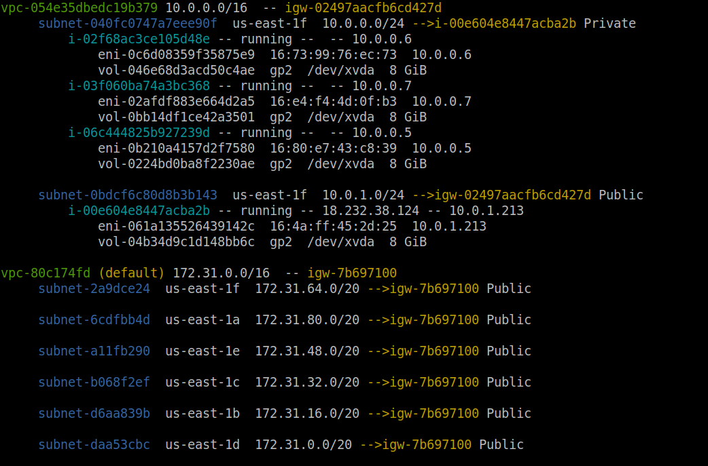
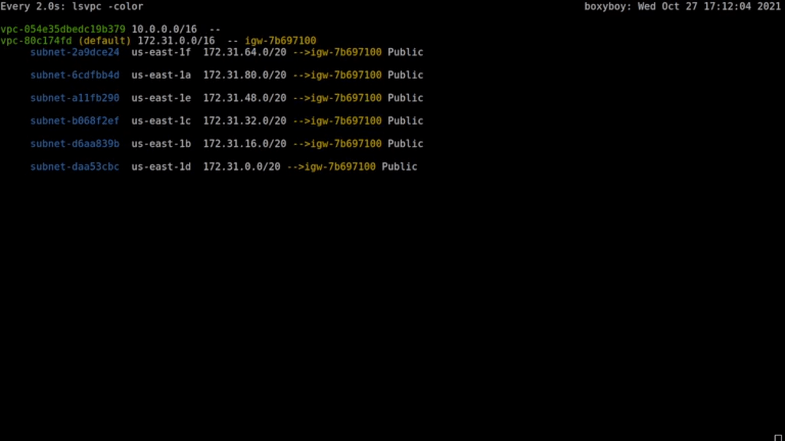

# lsvpc
A simple AWS VPC listing tool to provide quick introspection on the makeup of a VPC



One really cool use of this tool is to run:
```
watch -c lsvpc -color
```

To produce a live-updating display of the status of your vpcs:



# Installation and running

## Go Install

With [golang](https://go.dev/doc/install) installed, you may simply call:

```bash 
go install github.com/stigian/lsvpc@v1.0.8
```

## From Source

```
sudo make install
```

which will install the executable into /usr/local/bin/. To install in a different directory, such as /usr/bin/, simply override the `INSTALL` variable:

```
sudo INSTALL=/usr/bin/ make install
```

If **go** has been installed using the [tarball](https://golang.org/doc/install), the **go** binary is
probably not reachable the sudoers `secure_path`, and the path variable will need to be overridden when invoking sudo:

```
sudo env "PATH=$PATH" make install
```

which will install the `lsvpc` binary into /usr/local/bin/

# Usage

## Configuration and Permissions
This tool can make use of [named profiles](https://docs.aws.amazon.com/cli/latest/userguide/cli-configure-profiles.html) for authentication.
Be sure to `export AWS_PROFILE=<profile_name>` before executing this tool so that it can access awscli credentials. It will otherwise seek credentials in the order specified [here](https://docs.aws.amazon.com/sdk-for-go/api/aws/session/#hdr-Credential_and_config_loading_order). The `SharedConfig` option for sessions is enabled, and it will automatically seek environment variables, shared config/credential files or instance metadata for sdk credentials.

If sdk library is unable to find a default region from credentials or environment variables, lsvpc will default to using `us-east-1` for its operation.

Below are all of the SDK actions this tool uses, be sure that your aws credentials have IAM permissions for them:
```
ec2:DescribeEgressOnlyInternetGateways
ec2:DescribeInstances
ec2:DescribeInstanceStatus
ec2:DescribeInternetGateways
ec2:DescribeNatGateways
ec2:DescribeNetworkInterfaces
ec2:DescribeRegions
ec2:DescribeRouteTables
ec2:DescribeSecurityGroups
ec2:DescribeSubnets
ec2:DescribeTransitGatewayVpcAttachments
ec2:DescribeVolumes
ec2:DescribeVpcEndpoints
ec2:DescribeVpcPeeringConnections
ec2:DescribeVpcs
ec2:DescribeVpnGateways
```

## Execution

Executing **lsvpc** with no arguments produces a colored readout of vpc resources detected in the default region of your aws profile

### Parameters

`-a, -all`    - Prints data for all regions in account

`-nocolor`    - Suppresses color output. In general, lsvpc will also supress color if its output is piped

`-color`      - Force color output. Overrides nocolor, and will print color even if lsvpc's output is being sent through a pipe

`-nospace`    - Suppresses line spacing between entries.

`-r, -region` - Specify a region to print data for.

`-j`          - Output data in JSON
`-t`          - Truncate name tags
`-v`          - Output verbose information about assets in vpcs
